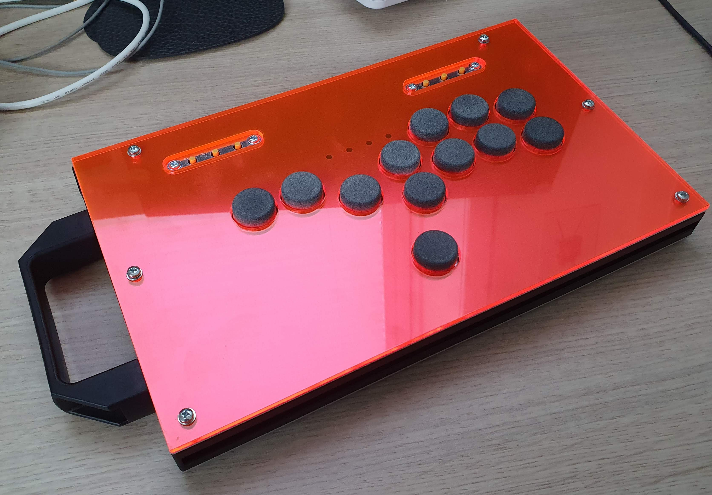

# Pangolin

Pangolin is an open system for designing & building custom game controllers, initially aimed at (but not limited to) controllers for competitive fighting games.

For now, this contains the files needed to produce the "default configuration", an all-button controller in the style of a Hit Box. More to come.

## Shopping list

### Enclosure

The DXF and STL files in this repo need to be manufactured.

The STL should be 3D printed in any material of your choice; I used PA12 SLS. It's a load-bearing part, so you want it to be reasonably strong. You just need to print 1× copy of this file; the file contains three brackets that you will cut apart.

The DXF files need to be either laser cut or manufactured by hand. You need 1× of each. All of the files except the acrylic top panel must be 1.5–1.6 mm thick. Metal (aluminium, brass, steel…) or FR4 (the stuff PCBs are made of) are good options for the switch plate. I recommend aluminium for the other panels. The top panel "acrylic" file can be any material you want, but people usually go with transparent acrylic; this allows you to install art of your choosing. It should be 3 mm thick.

Then you need to get 20×20 mm aluminium extrusions (aka 8020 profiles, T-slot structural framing…) cut to the following lengths (most places that sell these will cut them for you):

| Length | Quantity|
| --- | --- |
| 265 mm | 1× |
| 125 mm | 2× |
| 89 mm | 2× |

You also need 4× little gusseted brackets measuring about 20×20×20 mm, appropriate hardware for fixing them to the extrusions, and some end caps for the extrusions. All of these things can be bought from places that sell aluminium extrusions, including but not limited to: Motedis, 8020, Aluxprofiel…

You will need M3 bolts to assemble this build. A length of about 8 mm is appropriate for the top panels, and about 6 mm for the bottom and the connector panel. You will need M3 nuts for connecting the switch plate to the brackets. You will also need twist-in M3 T-nuts to hold the various bolts in the frame.

You will need 6 mm M3 spacer bolts for attaching the auxiliary buttons PCBs to the control panel at the correct height, along with some M3 nuts and 4 mm M3 bolts.

### Electronics

You will need 12× keyboard switches in the MX form factor. [There are many out there](switches.mx/switches); what you choose will be a matter of personal preference. If you're not sure what to pick, a linear switch (often identified as Black, Red, or Silver) is a great starting point.

You will need 12× round keycaps to fit these switches. The control panel has 22 mm cutouts, which means you should use keycaps less than 21 mm in diameter. I recommend [these](https://github.com/rana-sylvatica/circle-keycaps), which you can have cheaply in MJF PA12 nylon at JLCPCB & which feel fantastic to use. (Note that other keycaps might not be the same height; this can be a problem if you use shallower caps, as they will not protrude an appropriate distance from the control panel, and be annoying to press.)

You will need some wire to connect the keyboard switches to your encoder of choice. Optionally, you may also want to obtain 12× single-switch PCBs (such as Amoebas, [Model-MX1S](https://github.com/HTangl/MX1S), etc), as these will allow you to make the switches hot swappable (and soldering these PCBs, if you need to do it yourself, is easier than soldering directly to switches).

You will need 2× auxiliary button PCBs. The files for them can be found [here](https://github.com/henrebotha/aux-buttons-pcb/). They can be manufactured and assembled completely by JLCPCB; you don't need to do any soldering yourself.

You will need 2× 4-wire JST-PH cables to connect the auxiliary button PCBs to your encoder of choice. You can find these on Amazon and elsewhere.

You will need an encoder PCB. The enclosure is nominally designed to accept a Brook Fighting Board, but in its present form, this is an incredibly tight fit. You will need to use the absolute lowest-profile mounting for this that you can manage; perhaps nano tape? Even very low-profile adhesive PCB feet are too tall and will cause the USB port to be stressed as it presses into the switch plate. Should you opt for a Brook with a headphone jack, there is a hole on the control panel sized to accept a 3.5 mm panel-mount jack (which you will have to solder yourself — the jack that comes with these Brook boards is not accommodated). Similarly, if you opt for a Brook Wireless, there is a hole sized to fit the antenna. A Raspberry Pi Pico running the best-in-class open source [GP2040 firmware](https://github.com/OpenStickFoundation/GP2040-CE) is an excellent alternative to a Brook, and is much, much more compact, but requires soldering (though perhaps you can find one with convenient headers, screw terminals, etc).

You will need a panel-mount USB passthrough similar to the [Adafruit 907](https://www.adafruit.com/product/907). Variations on this can be found on Amazon, Aliexpress, etc, with slightly varying dimensions (particularly mounting hole distance). The connector panel _should_ accommodate most of these, but only the Adafruit one has been explicitly tested for fit.

You can optionally get a [Player LEDs PCB](https://bitbanggaming.com/products/player-leds-pcb) from Bit Bang Gaming; the control panel has mounting holes for the screws & holes for the light pipes.
